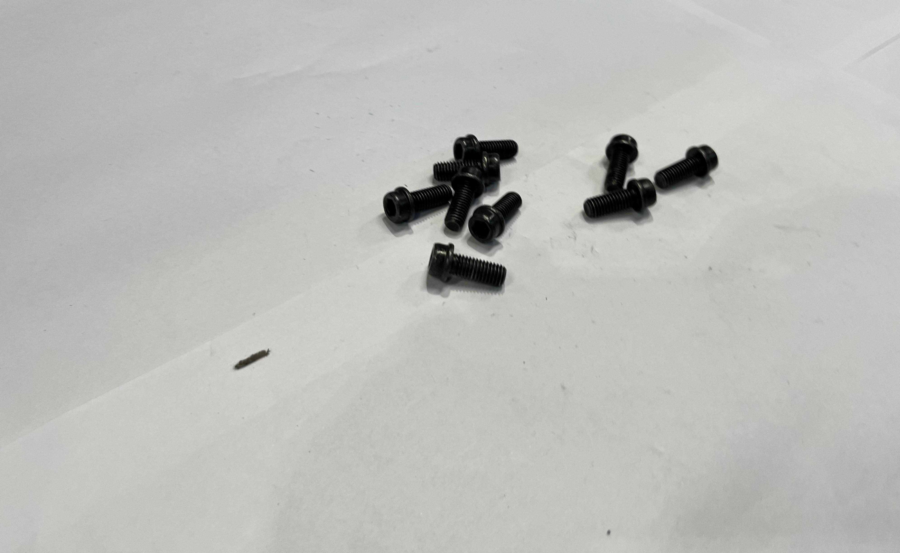
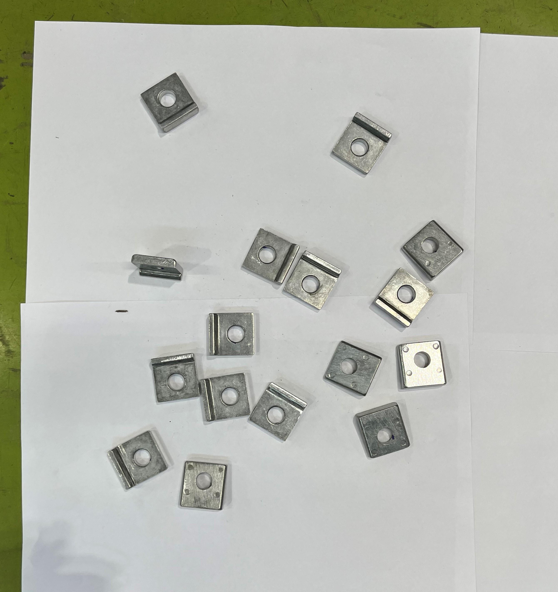
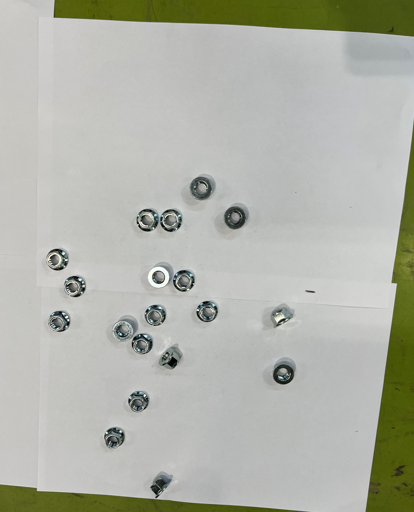

# Bursar

Bursar is a machine learning project, utilising masked RCNN as a way to count objects it has been trained on for industrial or personal use. It was developed during the Yamaha-AI hackathon held in April 2023.

## Pre-Requisites
- Python >= 3.6
- Scikit-image, Matplotlib and Numpy

## Installation

Clone the repository onto your local machine using git:

```bash
git clone https://github.com/Serpent03/yamaha-ai-hackathon.git
```

## Overview

Bursar can detect three different types of nuts and bolts, namely:
- Type A

- Type B

- Type C


It can also count and demarcate these objects with high success.

## Future Ideas

- Convert the model to run inside an android application for better mobility
- Command line based utilities for identifying through a large section of images
- Wrapper programs taking use of the command line based utilities for greater throughput
- API integration for online requests and responses 
